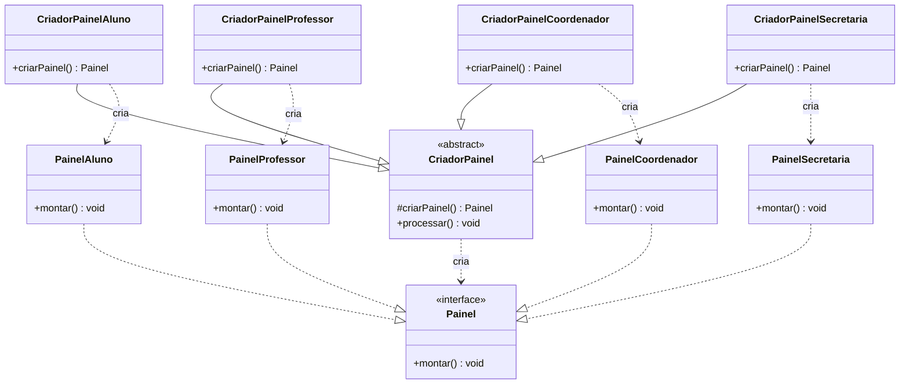

```mermaid

classDiagram

    class Painel {
        <<interface>>
        +montar() void
    }

    class PainelAluno {
        +montar() void
    }

    class PainelProfessor {
        +montar() void
    }

    class PainelCoordenador {
        +montar() void
    }

    class PainelSecretaria {
        +montar() void
    }

    class CriadorPainel {
        <<abstract>>
        #criarPainel() Painel
        +processar() void
    }

    class CriadorPainelAluno {
        +criarPainel() Painel
    }

    class CriadorPainelProfessor {
        +criarPainel() Painel
    }

    class CriadorPainelCoordenador {
        +criarPainel() Painel
    }

    class CriadorPainelSecretaria {
        +criarPainel() Painel
    }

    %% Produto e produtos concretos
    PainelAluno ..|> Painel
    PainelProfessor ..|> Painel
    PainelCoordenador ..|> Painel
    PainelSecretaria ..|> Painel

    %% Criador e criadores concretos
    CriadorPainelAluno --|> CriadorPainel
    CriadorPainelProfessor --|> CriadorPainel
    CriadorPainelCoordenador --|> CriadorPainel
    CriadorPainelSecretaria --|> CriadorPainel

    %% Factory Method
    CriadorPainel ..> Painel : cria
    CriadorPainelAluno ..> PainelAluno : cria
    CriadorPainelProfessor ..> PainelProfessor : cria
    CriadorPainelCoordenador ..> PainelCoordenador : cria
    CriadorPainelSecretaria ..> PainelSecretaria : cria
```